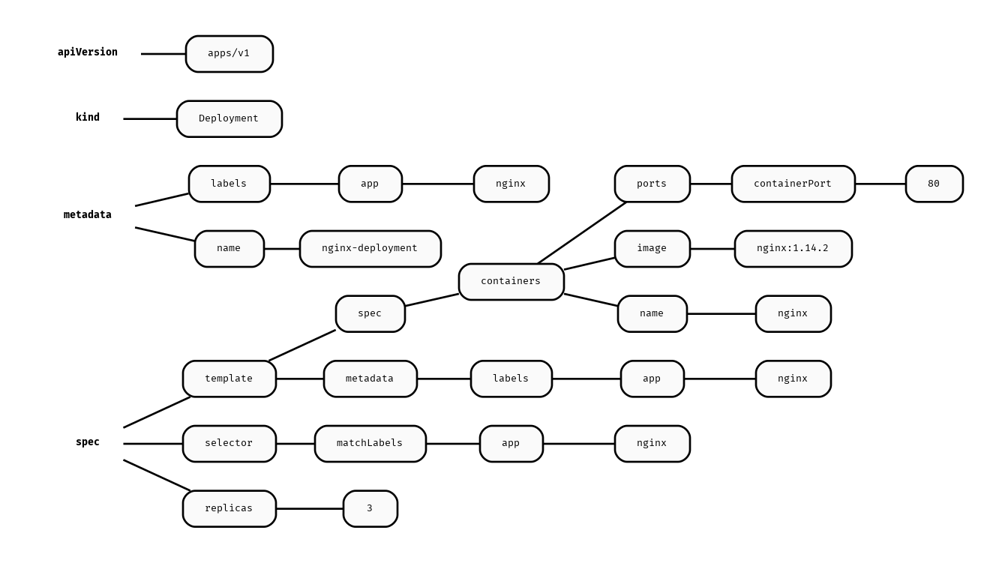

# [yml2dot](https://github.com/lucasepe/yml2dot/releases/latest) - Turn YAML into beautiful Graph

## Use Cases

- Visualize your YAML files as Graph
- Generate additional info from your source code (simply define a YAML block and use this tool)

## How [yml2dot](https://github.com/lucasepe/yml2dot/releases/latest) works?

Takes in input:

- any YAML file
- any text file that has YAML between comments (like [front matter](https://jekyllrb.com/docs/front-matter/))

Generates a [dot script](https://en.wikipedia.org/wiki/DOT_(graph_description_language)) for [Graphviz](https://graphviz.gitlab.io/download/).

# Examples

## Visualize a [Kubernetes Deployment](https://kubernetes.io/docs/concepts/workloads/controllers/deployment/) YAML file

Given a sample `deployment.yml` file:

```yaml
apiVersion: apps/v1
kind: Deployment
metadata:
  name: nginx-deployment
  labels:
    app: nginx
spec:
  replicas: 3
  selector:
    matchLabels:
      app: nginx
  template:
    metadata:
      labels:
        app: nginx
    spec:
      containers:
      - name: nginx
        image: nginx:1.14.2
        ports:
        - containerPort: 80
```

Run [yml2dot](https://github.com/lucasepe/yml2dot/releases/latest) like this:

```bash
$ yml2dot deployment.yml | dot -Tpng > deployment.png
```

and create this graph:



## Grab YAML info embedded in your source code

```java
/*** 
Box:
  Object:
    - set
    - get
***/

public class Box {
    private Object object;

    public void set(Object object) {
        this.object = object;
    }
    public Object get() {
        return object;
    }
}
```

> Use the `-from` and `-to` flags to mark your YAML block.

Run [yml2dot](https://github.com/lucasepe/yml2dot/releases/latest) like this:

```bash
$ yml2dot -from '/***' -to '***/' Box.java | dot -Tpng > Box.java.png
```

and create this graph:


## Piping YAML strings

You can also pipe YAML strings directly into `yml2dot`, allowing for dynamic generation and transformation of YAML data. This is particularly useful when combining `yml2dot` with other command-line tools in a Unix-style pipeline.

For example, to visualize a YAML string without creating an intermediate file:

```bash
echo "apiVersion: v1\nkind: Pod\nmetadata:\n  name: mypod" | yml2dot | dot -Tpng > mypod.png
```

Or, to dynamically generate a YAML configuration and immediately visualize it:

```bash
generate-yaml-config | yml2dot | dot -Tpng > config.png
```

This feature enhances `yml2dot`'s flexibility and integration into automated workflows and scripts.

# How to install?

If you have [golang](https://golang.org/dl/) installed:

```sh
$ go install github.com/lucasepe/yml2dot@latest
```

This will create the executable under your `$GOPATH/bin` directory.

## Ready-To-Use Releases 

If you don't want to compile the sourcecode yourself, [Here you can find the tool already compiled](https://github.com/lucasepe/yml2dot/releases/latest) for:

- MacOS
- Linux
- Windows

