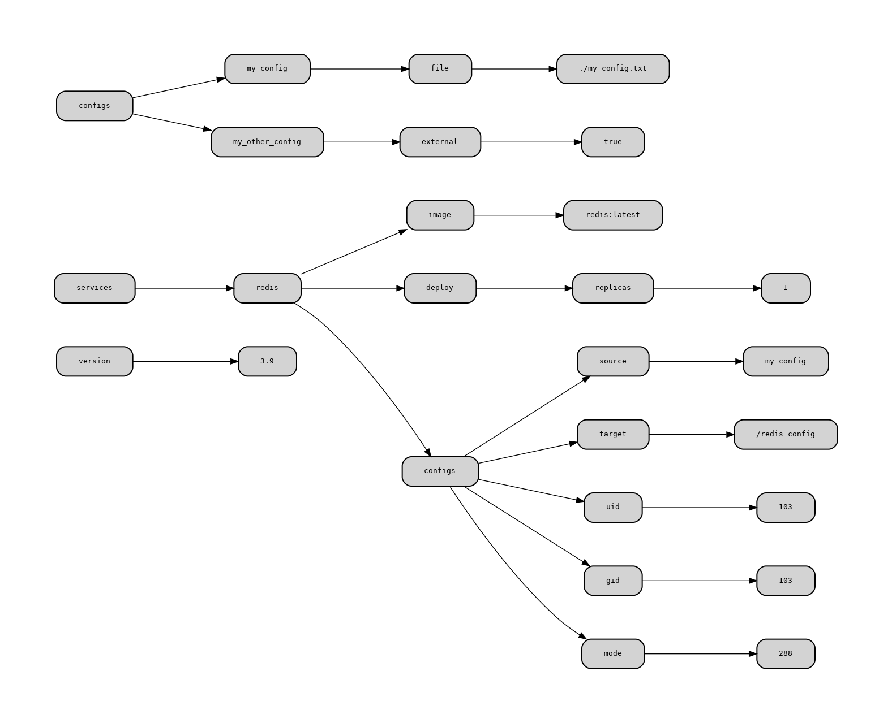
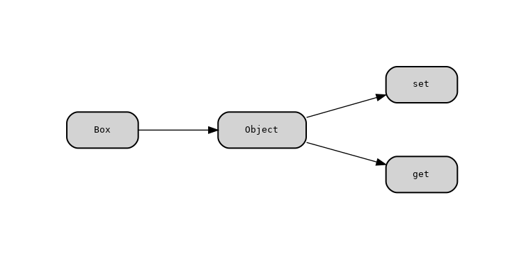

# [yml2dot](https://github.com/lucasepe/yml2dot/releases/latest) - Turn YAML into beautiful Graph

## Use Cases

- Visualize your YAML files as Graph
- Generate additional info from your source code (simply define a YAML block and use this tool)

## How [yml2dot](https://github.com/lucasepe/yml2dot/releases/latest) works?

Takes in input:

- any YAML file
- any text file that has YAML between comments (like [front matter](https://jekyllrb.com/docs/front-matter/))

Generates a [dot script](https://en.wikipedia.org/wiki/DOT_(graph_description_language)) for [Graphviz](https://graphviz.gitlab.io/download/).

# Examples

## Visualize a [docker-compose](https://docs.docker.com/compose/compose-file/) YAML file

Given a sample `docker-compose.yml` file:

```yaml
version: "3.9"
services:
  redis:
    image: redis:latest
    deploy:
      replicas: 1
    configs:
      - source: my_config
        target: /redis_config
        uid: '103'
        gid: '103'
        mode: 0440
configs:
  my_config:
    file: ./my_config.txt
  my_other_config:
    external: true
```

Run [yml2dot](https://github.com/lucasepe/yml2dot/releases/latest) like this:

```bash
$ yml2dot docker-compose-sample.yml | dot -Tpng > docker-compose-sample.yml.png
```

and create this graph:



## Grab YAML info embedded in your source code

```java
/*** 
Box:
  Object:
    - set
    - get
***/

public class Box {
    private Object object;

    public void set(Object object) {
        this.object = object;
    }
    public Object get() {
        return object;
    }
}
```

> Use the `-from` and `-to` flags to mark your YAML block.

Run [yml2dot](https://github.com/lucasepe/yml2dot/releases/latest) like this:

```bash
$ yml2dot -from '/***' -to '***/' Box.java | dot -Tpng > Box.java.png
```

and create this graph:




# How to install?

In order to use the `yml2dot` command, compile it using the following command:

```bash
go get -u github.com/lucasepe/yml2dot
```

This will create the executable under your $GOPATH/bin directory.

## Ready-To-Use Releases 

If you don't want to compile the sourcecode yourself, [Here you can find the tool already compiled](https://github.com/lucasepe/yml2dot/releases/latest) for:

- MacOS
- Linux
- Windows

